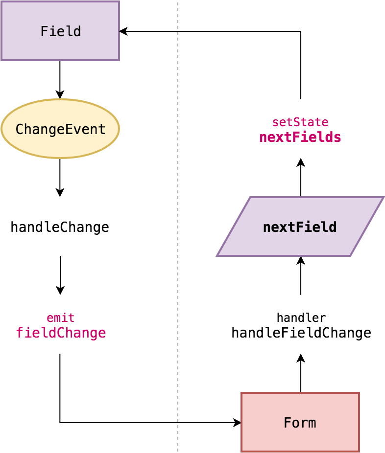
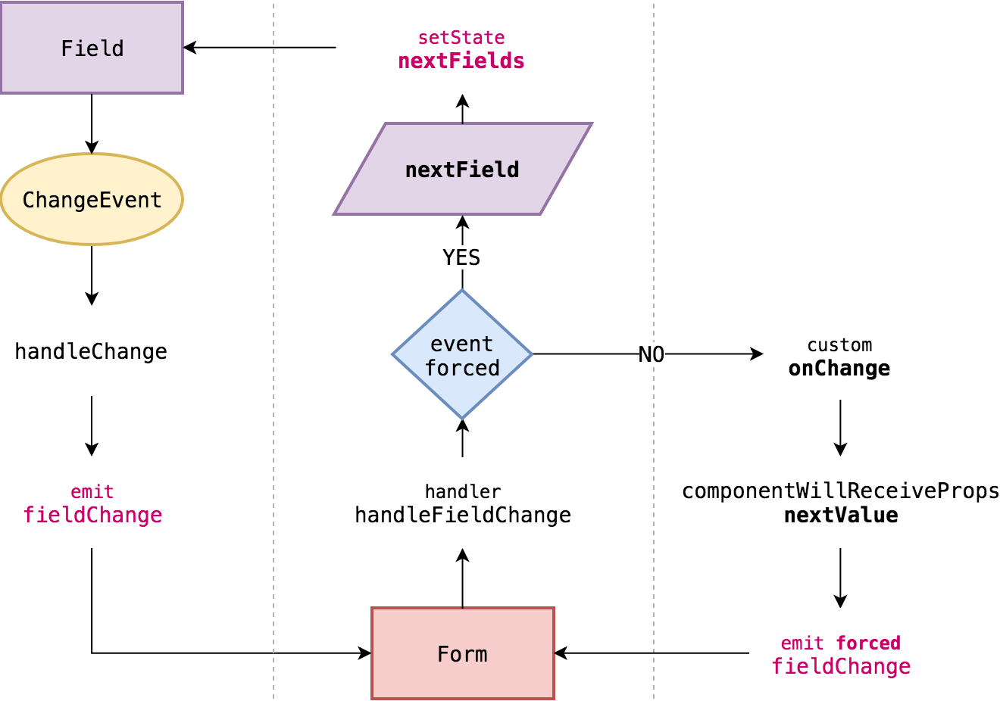

# Controlled fields

## Introduction


This topic concerns [Controlled fields](https://reactjs.org/docs/forms.html#controlled-components) pattern.


Let me begin by saying that React Advanced Form doesn't argue against controlled fields as such, and generally supports it \(moreover, all fields are controlled internally\). The point of this section is to explain when such pattern is needed, and when you won't benefit out of it.

## Favor uncontrolled

Making something controlled comes with the expense of maintenance. The more things you maintain, the more responsibility is delegated to your logic. This delegation is often unnecessary, making you do the job without getting the benefits out of it. Pay for what benefits you.

Most of the time people make a field controlled in order to access its value or state during certain form events \(i.e. validation, serialization, submit\). React Advanced Form treats those events as essentials, and exposes references to a field's state, the entire fields, and a form in [**all** **form callback methods**](../components/form/callbacks/).

## When to use controlled fields

* When you need to access a field's state in events that happen outside of a form, i.e. interactions with some UI elements \(**which you can also do using** [**form reference**](referencing.md#component-reference)\);

## Internals

### Uncontrolled update model

This model is called "uncontrolled" in regards to the end developer not being responsible for managing its value updates. Internally, all fields are controlled and stored in the `fields` map.



### Field update model

Controlled field implies that the end developer provides an explicit `onChange` handler responsible for updating the data source of a field's value.

Internally, that means that a field's value is no longer updated on `handlers.handleFieldChange`, but instead it invokes a custom `onChange` handler. Since the handler updates the data source, the field component will receive the next value and catch it in `componentWillReceiveProps`. Then it emits a forced `fieldChange` event, thus distinguishing that current field change should propagate to the fields.

As you can see, even with the controlled field the only source of truth for a field's state is still an internal instance of `fields` inside the form component.



## Example

You can make a field controlled in React Advanced Form the same you would do anywhere else: provide the `value` prop and the `onChange` handler to a field.

```jsx
import React from 'react'
import { Form } from 'react-advanced-form'
import { Input } from 'react-advanced-form-addons'

export default Example extends React.Component {
  state = {
    /* Source of truth */
    username: 'admin',
  }
  
  /**
   * Update the state based on the next value of the field.
   */
  handleUsernameChange = ({ nextValue }) => {
    this.setState({ username: nextValue })
  }
  
  render() {
    const { username } = this.state
    
    return (
      <Form>
        <Input
          name="username"
          /* Provide state property as the field's value */
          value={username}
          /* Provide change handler that updates the state */
          onChange={this.handleUsernameChange}
          required />
      </Form>
    )
  }
}
```


Read more on a field's [`onChange`](../components/field/callbacks/on-change.md) method and its parameters. You can access much more than just the next field's value.


